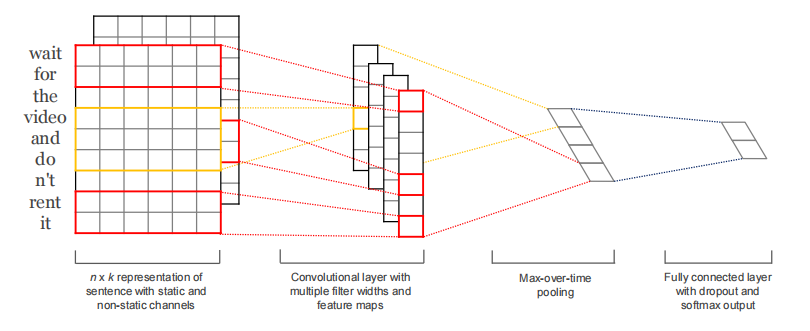
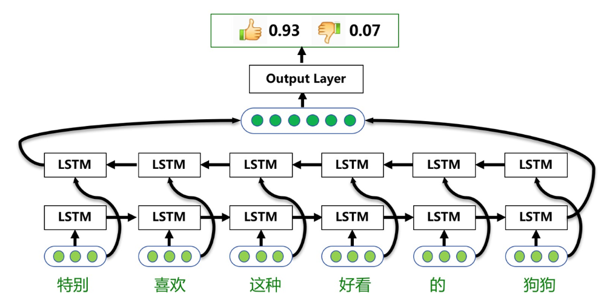
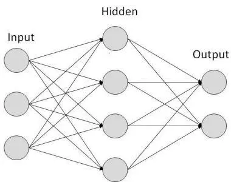

# 情感分析

# 一、模型结构以及流程分析

## 1.CNN

### 结构

与上图不同，我的模型中输入通道为1

网络结构由以下构成

- embedding：`(vocab_size, embedding_dim)`，用于在训练过程中更新词向量
- 三个独立的（卷积层+最大池化层）：与参考论文类似，卷积层采用三个不同大小的卷积核`（height=3/5/7, width=50(embedding_dim)）`，最大池化层采用全局最大池化（对每一个通只取一个最大值，具体来说核的大小为`(seq_length-3/5/7+1,1)`）
- Dropout层
- 输出层（全连接层+logsoftmax）：全连接层为3*out_channel到2

### 流程

预处理：给数据集中的所有词编号，建立word2index字典；从实验包中的wiki_word2vec_50.bin文件中提出所有word2index中有的词，建立index2vec字典

建立dataloader：对数据集，每句话的开头为标签，然后将其内容中每个词索引到它的index，最终dataloader中，对每句话：content是index的list，label是一个标量0/1

训练时：从dataloader获取到的数据是`(batch_size, seq_length, embedding_dim)`，将其先变为`(batch_size, in_channel=1, seq_length, embedding_dim)`再进到神经网络，分别经过三个卷积层`(batch_size, out_channel, 1, 1)`，拼接到一起再展平得到`(batch_size, 3*channel)`，最后通过全连接层以及logsoftmax得到最终返回的结果`(batch_size, 2)`

## 2.RNN

### 结构

网络结构由以下构成

- embedding：`(vocab_size, embedding_dim)`，用于在训练过程中更新词向量
- 三层双向LSTM：输入大小为embedding_dim，隐藏层大小为100, `batch_first=True`
- Dropout层
- 输出层（全连接层+logsoftmax）：全连接层为seq_length * 100(hidden_size)* 2(num_directions)到2

### 流程

前面流程相同

训练时：从dataloader获取到的数据是`(batch_size, seq_length, embedding_dim)`，首先经过三层的双向LSTM取其outputs`(batch_size, seq_length, num_directions * hidden_size)`，通过dropout，再展平得到`(batch_size, seq_length *num_directions * hidden_size)`，最后通过全连接层以及logsoftmax得到最终返回的结果`(batch_size, 2)`

## 3.baseline（MLP）

### 结构

网络结构由以下构成

- embedding：`(vocab_size, embedding_dim)`，用于在训练过程中更新词向量
- 6层全连接层+dropout：具体来说是从(seq_length * embedding_dim)→128→256→512→256→128→2
- 输出层：logsoftmax

### 流程

前面流程相同

训练时：从dataloader获取到的数据是`(batch_size, seq_length, embedding_dim)`，首先展平`(batch_size, seq_length*embedding_dim)`，通过六层全连接层以及dropout层`(batch_size, 2)`，最终通过logsoftmax得到最终返回的结果`(batch_size, 2)`

# 二、实验结果

|  | CNN | RNN | baseline |
| --- | --- | --- | --- |
| acc-test | 0.8238482384823849 | 0.8319783197831978 | 0.8238482384823849 |
| f1_score-test | 0.821917808219178 | 0.8368421052631578 | 0.8257372654155497 |
| acc-val | 0.8131106768520163 | 0.8051163616983479 | 0.8148871913306094 |
| f1_val | 0.8111988513998564 | 0.8196020391382995 | 0.81884561891516 |

CNN:

训练 `python3 [run.py](http://run.py) --model CNN --train --save`

训练好的模型 `python3 [run.py](http://run.py) --model CNN`

RNN:

训练 `python3 [run.py](http://run.py) —model RNN --train --save --drop_out 0.8` 

训练好的模型 `python3 [run.py](http://run.py) —model RNN`

baseline:

训练 `python3 [run.py](http://run.py) —model baseline --train --save --drop_out 0.75` 

训练好的模型 `python3 [run.py](http://run.py) —model baseline`

# 三、模型以及参数的效果差异

seq_length：最初采用80，效果一般，后来发现大多数句子长度大于100，故改为采用120，效果有所提升

weight_decay：最初采用1e-8（这也是经典的设置），后面经过多次测试发现1e-4表现出更好的效果，分析可能是因为在实验中数据集相对小而模型相对复杂因此采用一个较大的weight_decay抑制模型，避免过拟合，这样能带来较好的效果

## MLP

收敛最快，正确率居中

经测试drop_out为0.75时效果较好，可能是因为本身模型较大但数据相对较少，因此容易过拟合，故需采用一个较高的drop_out

## CNN

收敛最慢，比较稳定，正确率最低（应该是我还未调试到最好，过拟合现象未能很好解决）

## RNN

收敛速度居中，正确率较好

测试得到drop_out为0.8时效果较好

# 四、问题思考

## 1.训练何时停止

### 何时停止最合适

当训练集的loss不断减小或者指标不断优化，但是验证集的loss从减小到开始变大（指标从优化开始变成退化）时。也就是最佳的拟合状态—充分拟合同时避免过拟合。具体来说：我会首先固定一个较大的epochs，实时打印训练集以及验证集的结果（包括loss, acc, f1_score），当我观察到训练集对应的结果仍在不断变好但是验证集的结果开始变坏时，记录下这样的epoch并将其作为最终的新的epochs

### 固定迭代次数与通过验证集调整等方法的优缺点

固定迭代次数优点是实现简单而且便于不同模型之间的训练情况的比较，但是缺点是时间长，耗费资源

通过验证集调整可以节省时间以及计算资源，缺点是实现相对复杂

## 2.参数初始化

本实验中采用的初始化方法：除了embedding采用预训练的word2vec外，均采用pytorch的默认初始化。

- Xavier初始化：通过保持输入和输出的方差一致（服从相同的分布）避免梯度消失和梯度爆炸问题。比较适合激活函数为**tanh**的情况，不太适合relu
- kaiming均匀、正态初始化：正态分布的均值为0、方差为sqrt( 2/fan_in )。均匀分布的区间为[-sqrt( 6/fan_in) , sqrt(6/fan_in)]。适用于使用**ReLU、Leaky ReLU**等非线性激活函数的网络。
- 正交初始化：使神经网络中的权重矩阵保持正交性，从而减少梯度消失和爆炸的问题。比较适合RNN, LSTM

## 3.过拟合问题

### 产生原因

- 样本数太少
- 噪声干扰过大
- 参数太多，模型过于复杂

### 解决方法

- 增加训练数据：包括增加数据量，利用现有数据进行扩充（图片的翻转、拉伸等）等
- 使用dropout，按一定的比例去除隐藏层的神经单元，使神经网络的结构简单化。
- early stopping， 在模型迭代训练时候记录训练精度(或损失)和验证精度(或损失)，如果模型训练的效果不再提高，比如训练误差一直在降低但是验证误差却不再降低甚至上升，则可以提前结束。或者
- 减少特征数，**去掉非共性的特征**
- 使用正则化约束，在loss中增加惩罚项

## 4.CNN, RNN, MLP优缺点

### CNN

优点

- 可以自动进行特征提取，比如自动学习的图像特征比手动设置的更好
- 共享卷积核，使得它适合于处理高维数据。数据集大时，精度高结果可靠
- 处理图像中的平移不变性时非常有效，很适合处理视觉问题。

缺点

- 池化层会丢失一些有价值信息，忽略局部与整体之间关联性
- 容易过拟合
- 网络太深时BP算法会导致靠近输入的参数变化较慢

### RNN

优点

- 适合处理序列问题，能够记忆上一时间的输入信息，输入数据的判别和预测与相邻数据有关
- 可以处理任意长度的输入
- 权重时间共享

缺点

- 计算速度慢
- 梯度爆炸和梯度消失，难以捕捉长期依赖

### MLP

优点

- 计算快
- 简单易用
- 表示能力强：参数足够多可以逼近任何函数

缺点

- 计算量过大
- 容易过拟合
- 输入尺寸固定，容易丢失图像空间特征

# 五、心得体会

本次实验中，我利用pytorch实现了CNN, RNN, MLP。体会到了调参、优化的艰辛。

词嵌入随着训练更新的方式明显好于词向量固定的方式（这导致我之前固定词向量时难以达到0.8的分数）：根据语料调整词向量，显然会由于一个在另外的数据集上预训练好的词向量

给我印象最深的是调参的过程，其中会涉及到很多可以优化的点，比如梯度爆炸怎么办，如何调整学习率，如何选择优化器等等。在调参以及查阅资料过程中，我了解到

- 过拟合调试可以确保神经网络结构的合理性，如果失败可能说明神经网络结构首先不对或者不适合
- 通过打印一些训练信息或者可视化的方法有利于调参
- reshape可能会破坏空间特征导致学习更加困难